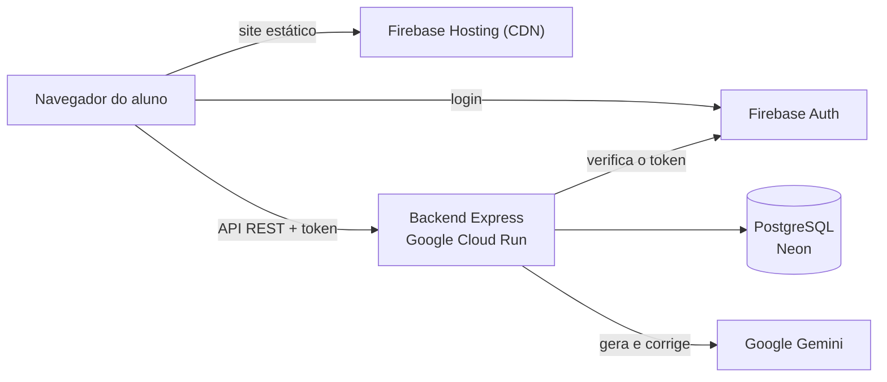

<div align="center">
  
  <br>
  <h1>🌟 Plataforma Lumen</h1>
  <p><strong>Simulados personalizados e correção detalhada com Inteligência Artificial</strong></p>
  <p><a href="https://lumenm.web.app">lumenm.web.app</a></p>
</div>

---

A **Lumen** é uma plataforma de estudos em que o aluno monta simulados sob medida — por nível, matéria e tópico, ou a partir do próprio material de aula — e recebe a correção de cada questão, inclusive das discursivas. Um banco de questões (oficiais e geradas) é combinado com a geração e a correção do Google Gemini.

## 🚀 Funcionalidades

- 🧠 **Simulados por matéria:** do Ensino Fundamental ao Ensino Superior. O sistema usa primeiro o banco de questões (priorizando as que o aluno ainda não respondeu) e a IA cria as que faltarem.
- 📎 **Simulados a partir do seu material:** envie até 5 arquivos (PDF, TXT ou MD) ou cole suas anotações; a IA cria questões fiéis ao conteúdo. Essas questões são **privadas** e não entram no banco público.
- 🎯 **Questões oficiais:** opção de priorizar questões reais de ENEM, FUVEST, UNICAMP e outras bancas.
- 📝 **Correção no servidor:** múltipla escolha conferida com o gabarito do banco e discursivas corrigidas pela IA, com nota de 0 a 100, comentário e resposta esperada.
- ⏱️ **Tempo médio na tela:** durante a geração e a correção, o aluno vê o tempo médio real (medido no servidor), o tempo decorrido e uma barra de progresso.
- 📊 **Desempenho:** média geral, domínio por matéria (gráfico), histórico de simulados com os comentários de cada correção e opção de refazer.
- 📄 **Exportar PDF:** a prova sai diagramada para imprimir, com linhas para as discursivas e folha de gabarito quando o simulado já foi corrigido.
- 🌓 **Modo escuro** que segue o sistema na primeira visita e lembra a escolha do aluno.
- ♿ **Acessibilidade:** navegação por teclado, leitores de tela, contraste WCAG AA e respeito a "reduzir movimento".

## 🏗️ Arquitetura



- **Frontend:** Next.js exportado como site estático (`output: "export"`) e servido pela CDN do Firebase Hosting — sem servidor para "acordar".
- **Backend:** API Express em container no Google Cloud Run. Cada requisição é autenticada com o token do Firebase; o gabarito nunca vai para o navegador antes da correção.
- **Banco:** PostgreSQL no Neon, com migrações versionadas aplicadas automaticamente quando o servidor sobe.
- **IA:** Gemini, com os modelos "lite" (mais rápidos e estáveis) primeiro e modelos reserva. Detalhes em [Como a IA é usada](#-como-a-ia-é-usada).

## 🛠️ Tecnologias

| Camada | Tecnologias |
|---|---|
| Frontend | Next.js 16 (React 19), Tailwind CSS v4, Firebase Auth, Recharts, Lucide |
| Backend | Node.js 24, Express 5, `@google/genai`, `pg`, Helmet, express-rate-limit, Multer |
| Dados | PostgreSQL (Neon) com `pg_trgm` |
| Infraestrutura | Firebase Hosting, Google Cloud Run, Secret Manager, Artifact Registry |

## 🤖 Como a IA é usada

- **Modelos em cadeia com reserva em paralelo:** começa pelo modelo principal; se ele falhar, o próximo é chamado na hora; se só demorar, o reserva começa **em paralelo** e vale a primeira resposta válida. Modelos que falharam há pouco saem da frente por um tempo. Assim, uma sobrecarga do Gemini não faz o aluno esperar.
- **Geração em lotes paralelos:** 20 questões viram 4 lotes de 5 gerados ao mesmo tempo, cada um com um foco diferente, e questões repetidas são descartadas.
- **Formato garantido:** a resposta é pedida em JSON com schema (`responseSchema`) e validada no servidor (ex.: exatamente uma alternativa correta).
- **Correção resistente a manipulação:** a resposta do aluno vai delimitada no prompt e a nota é sempre limitada a 0–100.
- **Métricas:** cada geração e correção registra o tempo real, e a mediana recente aparece para o aluno.

Os modelos e prazos ficam em [`backend/src/config.js`](backend/src/config.js) e podem ser trocados por variável de ambiente.

## 📁 Estrutura

```
lumen/
├── backend/
│   ├── src/
│   │   ├── api/routes/        # simulado, desempenho, correção
│   │   ├── api/middlewares/   # autenticação, limites de uso, upload, erros
│   │   ├── core/              # Firebase Admin e cliente do Gemini
│   │   ├── db/                # conexão e migrações versionadas
│   │   ├── services/          # prompts, questões, correção, métricas
│   │   ├── app.js             # aplicação Express
│   │   └── index.js           # migra o banco e sobe o servidor
│   ├── Dockerfile
│   └── docker-compose.yml     # Postgres para desenvolvimento
└── frontend/
    └── src/
        ├── app/               # páginas: login, cadastro, início, simulado, desempenho
        ├── components/        # interface (inclui componentes de acessibilidade)
        └── lib/               # cliente da API, tipos, Firebase
```

## 💻 Rodando localmente

**Pré-requisitos:** Node.js 20 ou superior, Docker (para o Postgres local), um projeto no [Firebase](https://console.firebase.google.com/) com login por e-mail/Google e uma [chave do Gemini](https://aistudio.google.com/apikey).

### Backend

```bash
cd backend
npm install
cp .env.example .env        # preencha as variáveis (veja a tabela abaixo)
docker compose up -d        # Postgres local, acessível só em localhost
npm run dev                 # http://localhost:3001
```

O servidor aplica as migrações pendentes antes de aceitar requisições (também dá para rodar `npm run migrate`). Nunca edite uma migração já aplicada: crie uma nova no fim da lista em [`backend/src/db/migrate.js`](backend/src/db/migrate.js).

### Frontend

```bash
cd frontend
npm install
# crie frontend/.env.local (veja a tabela abaixo)
npm run dev                 # http://localhost:3000
```

### Variáveis de ambiente

**Backend** (`backend/.env`):

| Variável | Descrição |
|---|---|
| `DATABASE_URL` | Conexão do Postgres (em produção). Localmente dá para usar `DB_USER`, `DB_PASSWORD`, `DB_HOST`, `DB_PORT` e `DB_NAME`. |
| `DB_SSL` | `disable`, `require` ou `verify` (opcional). |
| `GEMINI_API_KEY` | Chave da API do Gemini. |
| `FIREBASE_PROJECT_ID` | Projeto do Firebase usado para validar os tokens de login. |
| `CORS_ORIGINS` | Domínios do frontend autorizados, separados por vírgula (em desenvolvimento, `localhost:3000` já é liberado). |
| `LIMITE_GERACOES_HORA`, `LIMITE_GERACOES_DIA`, `LIMITE_CORRECOES_HORA`, `LIMITE_REQUISICOES_IP` | Limites de uso por conta e por IP (opcionais). |
| `GEMINI_MODELOS_GERACAO`, `GEMINI_MODELOS_CORRECAO` | Cadeia de modelos, separados por vírgula (opcionais). |

**Frontend** (`frontend/.env.local`):

| Variável | Descrição |
|---|---|
| `NEXT_PUBLIC_API_URL` | URL da API, terminando em `/api` (ex.: `http://localhost:3001/api`). |
| `NEXT_PUBLIC_FIREBASE_API_KEY`, `..._AUTH_DOMAIN`, `..._PROJECT_ID`, `..._STORAGE_BUCKET`, `..._MESSAGING_SENDER_ID`, `..._APP_ID` | Configuração web do Firebase. |
| `NEXT_PUBLIC_FIREBASE_AUTH_EMULATOR` | Opcional: URL do emulador de login (ex.: `http://127.0.0.1:9099`) para testar sem contas reais. |

## 🚢 Deploy

**Backend — Google Cloud Run** (projeto `lumenm-api`, região `us-east1`):

```bash
cd backend
npm run deploy
```

- A imagem é gerada pelo `Dockerfile`; o `.gcloudignore` impede que `.env` e chaves sejam enviados.
- `DATABASE_URL` e `GEMINI_API_KEY` ficam no Secret Manager (`lumen-database-url` e `lumen-gemini-api-key`), e o serviço roda com uma conta de serviço que só acessa esses segredos. A configuração é mantida entre deploys.
- A cobrança fica só no projeto `lumenm-api`; o projeto do Firebase fica sem cobrança, para a chave do Gemini continuar no nível gratuito.
- Use a conexão **direta** do Neon (sem `-pooler` no host) com `?sslmode=verify-full`: as migrações usam advisory locks, que não funcionam através do PgBouncer.
- No PowerShell, chame o gcloud como `gcloud.cmd`.

**Frontend — Firebase Hosting:**

```bash
cd frontend
npm run deploy              # next build + firebase deploy --only hosting
```

Os cabeçalhos de segurança (CSP, proteção contra framing, cache) estão em [`frontend/firebase.json`](frontend/firebase.json).

## 🔒 Segurança

- **Gabarito protegido:** durante a prova o navegador recebe as questões sem gabarito; a nota é calculada no servidor com os dados do banco.
- **Material privado:** questões criadas a partir do material do aluno nunca entram no banco público.
- **Limites de uso** da IA por conta e por IP, persistidos no Postgres.
- **Entrada validada:** tamanho, tipo e assinatura dos arquivos, listas fechadas de opções e erros internos que nunca chegam ao navegador.
- **Cabeçalhos de segurança** (Helmet no backend, CSP no hosting), CORS restrito e senhas só no Secret Manager.
- Nunca faça commit de `.env` nem de arquivos de service account: o backend só precisa do `FIREBASE_PROJECT_ID`.

## ♿ Acessibilidade

A interface foi auditada com [axe-core](https://github.com/dequelabs/axe-core) (WCAG 2.1 AA) nas telas principais, em modo claro, escuro e no celular: rótulos ligados aos campos, nomes em botões de ícone, modais com `<dialog>`, avisos anunciados por leitores de tela, feedback de acerto/erro que não depende só de cor e foco sempre visível.
